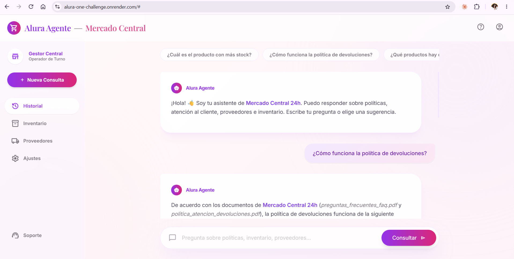

# 🛒 Alura Agente — Asistente de IA para Mercado Central 24h

Agente de inteligencia artificial que responde preguntas en lenguaje natural sobre
la documentación interna de **Mercado Central 24h** (un supermercado de operación
continua 24/7): políticas, preguntas frecuentes, reglamento interno, manual de
proveedores y el **inventario de productos**.

En lugar de abrir cada documento, cualquier persona colaboradora escribe una
pregunta y el agente encuentra y devuelve la respuesta.

> Proyecto del **Challenge Alura Agente** — del documento al *deploy* en la nube.

---

## 🧠 ¿Qué puede responder?

El agente combina dos fuentes de información y decide cuál usar en cada pregunta:

| Tipo de pregunta | Fuente | Ejemplo |
|---|---|---|
| Políticas, normas, FAQ | 4 PDF | *"¿Cómo funciona la política de devoluciones?"* |
| Datos de productos | Inventario (Excel) | *"¿Cuál es el producto con más stock?"* |

---

## 🏗️ Arquitectura

El proyecto implementa el patrón **RAG (Retrieval-Augmented Generation)** combinado
con un **agente de herramientas**: Claude decide, en cada pregunta, qué herramienta
usar para fundamentar su respuesta.

```
                        Pregunta del usuario
                                │
                                ▼
                ┌───────────────────────────────┐
                │   Google Gemini (API)          │
                │   — decide qué herramienta usar │
                └───────────────┬───────────────┘
                    │                       │
        ┌───────────▼──────────┐   ┌────────▼─────────────┐
        │ buscar_en_documentos │   │ consultar_inventario │
        │  (RAG semántico)     │   │  (consulta pandas)   │
        └───────────┬──────────┘   └────────┬─────────────┘
                    │                       │
        ┌───────────▼──────────┐   ┌────────▼─────────────┐
        │ Índice de embeddings │   │  inventario .xlsx    │
        │ (Gemini embeddings + │   │  (200 productos)     │
        │       NumPy)         │   │                      │
        │  ← 4 PDF fragmentados │   │                      │
        └──────────────────────┘   └──────────────────────┘
                    │
                    ▼
        Respuesta en lenguaje natural + fuentes citadas
                    │
                    ▼
         FastAPI (API /chat + página web de chat)
                    │
                    ▼
              Deploy en Oracle Cloud (OCI)
```

### ¿Cómo funciona el RAG?
1. **Ingesta**: los 4 PDF se leen con *PyPDF*, se dividen en fragmentos (~900
   caracteres con solapamiento) y se convierten en vectores (*embeddings*) con un
   la API de embeddings de Gemini (multilingüe).
2. **Búsqueda**: la pregunta se convierte en un vector y se comparan por
   **similitud del coseno** con los fragmentos para recuperar los más relevantes.
3. **Generación**: Claude recibe esos fragmentos como contexto y redacta la
   respuesta, citando la fuente.

Para el **inventario** se usa una herramienta aparte que consulta directamente el
Excel con *pandas* (filtrar, ordenar, buscar), lo que permite responder con
precisión preguntas de datos como "el producto más caro" o "el de mayor stock".

---

## 🧰 Tecnologías utilizadas

| Componente | Herramienta | Motivo |
|---|---|---|
| Lenguaje | **Python 3.12** | Ecosistema de IA |
| Modelo de lenguaje (LLM) | **Google Gemini** (`gemini-flash-latest`) | Motor del agente y las respuestas |
| Lectura de PDF | **PyPDF** | Extraer texto de los documentos |
| Lectura de Excel | **Pandas + openpyxl** | Consultar el inventario |
| Embeddings | **Gemini** (`gemini-embedding-001`) | Búsqueda semántica multilingüe vía API (ligero para servidores pequeños) |
| Búsqueda vectorial | **NumPy** (similitud del coseno) | Ligera, sin dependencias pesadas |
| Backend / Web | **FastAPI + Uvicorn** | API `/chat` y página de chat |
| Deploy | **Oracle Cloud Infrastructure (OCI Compute)** | Aplicación pública en la nube |

> Usa la **API gratuita** de Google Gemini tanto para el modelo de lenguaje como
> para los *embeddings*, por lo que el proyecto funciona **sin costo** y es ligero
> de desplegar (no descarga modelos pesados).

---

## 📁 Estructura del proyecto

```
alura-one-challenge/
├── app/
│   ├── config.py        # Rutas y parámetros
│   ├── ingest.py        # Lee PDF y construye el índice de embeddings
│   ├── retriever.py     # Búsqueda semántica (RAG)
│   ├── inventory.py     # Consultas sobre el inventario (Excel)
│   ├── agent.py         # Agente Gemini con 2 herramientas
│   ├── main.py          # API FastAPI + página de chat
│   └── templates/
│       └── index.html   # Interfaz de chat
├── data/
│   └── documents/       # 4 PDF + 1 Excel de Mercado Central 24h
├── requirements.txt
├── .env.example
└── README.md
```

---

## ▶️ Cómo ejecutar el proyecto en local

### 1. Requisitos
- Python 3.10 o superior
- Una clave gratuita de Google Gemini → [aistudio.google.com/app/apikey](https://aistudio.google.com/app/apikey)

### 2. Instalación
```bash
# Clonar el repositorio
git clone https://github.com/bianca-zorio/alura-one-challenge.git
cd alura-one-challenge

# Crear entorno virtual e instalar dependencias
python -m venv .venv
source .venv/bin/activate        # En Windows: .venv\Scripts\activate
pip install -r requirements.txt
```

### 3. Configurar la clave
```bash
cp .env.example .env
# Edita .env y coloca tu GOOGLE_API_KEY
```

### 4. Construir el índice (una sola vez)
```bash
python -m app.ingest
```

### 5. Levantar el servidor
```bash
uvicorn app.main:app --reload
```
Abre **http://localhost:8000** y empieza a preguntar. 🎉

---

## 💬 Ejemplos de preguntas y respuestas

> **P:** ¿Cuál es el producto con más stock?
> **R:** El producto con mayor stock es la *Cerveza Clara Lata 355ml* (marca Corona),
> con 500 unidades disponibles, junto con la *Leche UHT Entera 1L* (Lala) y el
> *Lavaplatos Líquido Neutro 500ml* (Salvo), también con 500 unidades.
> *(Fuente: inventario_supermercado.xlsx)*

> **P:** ¿Cómo funciona la política de devoluciones?
> **R:** Según la política de atención al cliente, las devoluciones se rigen por el
> marco legal aplicable y contemplan cambios estándar y reembolsos según el caso…
> *(Fuente: politica_atencion_devoluciones.pdf)*

> **P:** ¿Qué productos hay de la categoría Abarrotes?
> **R:** En Abarrotes hay productos como Arroz Blanco Tipo 1 5kg (Verde Valle),
> Arroz Parbolizado 5kg (Goya)… *(Fuente: inventario_supermercado.xlsx)*

> **P:** ¿El supermercado atiende las 24 horas?
> **R:** Sí, Mercado Central 24h es un supermercado de operación continua (24/7)…
> *(Fuente: preguntas_frecuentes_faq.pdf)*

---

## ☁️ Deploy (aplicación en vivo)

La aplicación está desplegada en **Render** con **HTTPS** automático:

### 🔗 **https://alura-one-challenge.onrender.com**



El despliegue es automático a partir del archivo [`render.yaml`](render.yaml): Render
instala las dependencias, versionamos el índice ya construido (`data/index/`) para que
el arranque sea inmediato, y la clave de Gemini se configura como variable de entorno
secreta en el panel de Render.

> **Nota del plan gratuito:** si la app no recibe visitas por ~15 minutos, Render la
> "duerme"; la primera petición después tarda ~30-50 s en despertar y luego responde
> con normalidad.

> También se incluye una **guía alternativa de despliegue en Oracle Cloud (OCI)** con
> nginx y HTTPS en [DEPLOY.md](DEPLOY.md), por si se prefiere esa plataforma.

---

## 📌 Notas
- Los documentos usados son de ejemplo, provistos por el challenge, y pueden
  sustituirse por cualquier PDF/CSV colocándolos en `data/documents/` y volviendo
  a ejecutar `python -m app.ingest`.
- El índice de embeddings (`data/index/`) se versiona en el repositorio para que el
  despliegue no tenga que reconstruirlo.
